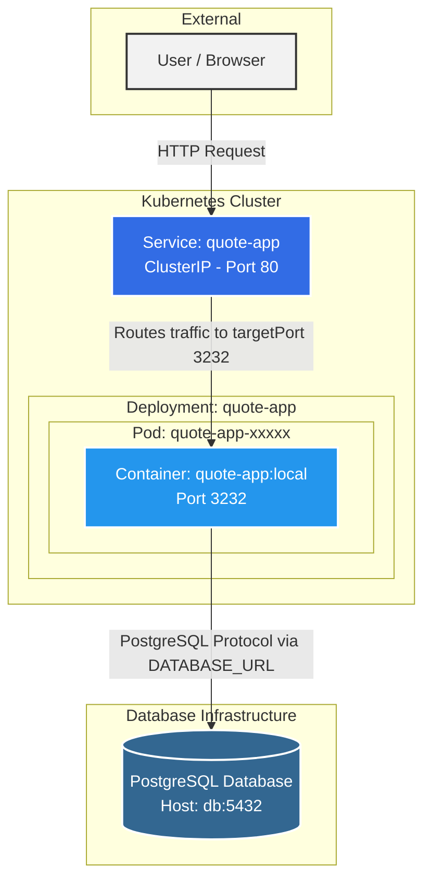

# Architecture du Projet

## Diagramme d'Architecture

Voici un diagramme symbolisant le flux et l'organisation de l'application :



---

## Réponses aux questions

### 1. Where does isolation happen? (Où l'isolation se produit-elle ?)
L'isolation a lieu principalement à deux niveaux :
* **Niveau Conteneur (Docker) :** Les processus de l'application Node.js sont isolés du reste du système hôte via les *namespaces* et les *groups* de Linux. L'application possède son propre système de fichiers (l'image), ses propres bibliothèques et son propre réseau. 
* **Niveau Pod (Kubernetes) :** Le Pod encapsule les conteneurs et fournit une isolation logique supplémentaire au sein du cluster Kubernetes en leur attribuant une IP unique et un espace réseau partagé exclusif.

### 2. What restarts automatically? (Qu'est-ce qui redémarre automatiquement ?)
Ce sont les **Pods (et leurs conteneurs sous-jacents)** qui redémarrent automatiquement. 
* Si le processus du conteneur Node.js (ou la sonde `readinessProbe`) subit une erreur fatale ou s'arrête (`crash`), le Kubelet du nœud va automatiquement redémarrer le conteneur.
* Si un Pod tout entier échoue, est supprimé, ou que le nœud physique "meurt", la ressource **Deployment** (grâce à son **ReplicaSet**) détecte que le nombre de réplicas en cours (0) ne correspond pas au nombre de réplicas désiré (`replicas: 1`). Elle va donc automatiquement déclencher la création d'un tout nouveau Pod pour le remplacer sans intervention humaine.

### 3. What does Kubernetes not manage? (Qu'est-ce que Kubernetes ne gère pas ?)
Bien que très puissant, Kubernetes ne gère pas :
* **La logique de l'application et ses bugs :** Si le code Node.js renvoie des erreurs 500 ou que la logique métier est défaillante (sans pour autant crasher le processus), Kubernetes ne corrigera pas l'application pour vous.
* **Les données dans la base PostgreSQL :** Si des enregistrements sont supprimés ou que les données de la base sont corrompues, Kubernetes n'est pas responsable du contenu de la base de données. Il peut s'assurer que le service qui héberge la base tourne, mais il ne gère pas les sauvegardes métiers ou les migrations SQL.
* **Le DNS / Routage externe sans configuration explicite :** Dans ce projet, vous n'avez configuré qu'un service `ClusterIP` (interne). Kubernetes ne gérera pas un accès public externe (comme un nom de domaine ou un CDN) tant qu'une ressource **Ingress** ou **LoadBalancer** n'est pas explicitement définie.

---

## Comparaison Conteneurs vs Machines Virtuelles (VM)

### Tableau comparatif

| Critère | Conteneurs | Machines virtuelles (VM) |
| :--- | :--- | :--- |
| **Partage du noyau (Kernel)** | Partagent le noyau du système d'exploitation de l'hôte (Linux). | Chaque VM a son propre système d'exploitation complet et son propre noyau, géré par un hyperviseur. |
| **Temps de démarrage** | Très rapide (quelques millisecondes à secondes) car il n'y a pas d'OS à démarrer. | Plus lent (plusieurs secondes à minutes) car un système d'exploitation entier doit *booter*. |
| **Surcoût de ressources (Overhead)** | Très faible. Ce sont de simples processus isolés sans duplication de l'OS. | Élevé. Chaque VM nécessite des ressources CPU, RAM et disque virtuelles dédiées pour faire tourner son propre OS. |
| **Isolation et sécurité** | Isolation logique via les fonctionnalités du noyau Linux (Namespaces, cgroups). Moins forte qu'une VM. | Isolation matérielle (virtualisée). Chaque VM est totalement cloisonnée des autres par l'hyperviseur. Très haute sécurité. |
| **Complexité opérationnelle** | Images légères, déploiement massif et orchestration complexe (ex: Kubernetes). Cycle de vie rapide. | Gestion plus lourde : il faut patcher, mettre à jour et maintenir l'OS de chaque VM individuellement. |

### Quand préférer une VM à un conteneur ?

Vous devriez privilégier une Machine Virtuelle dans les cas suivants :
* **Besoin d'une isolation stricte de sécurité :** Par exemple, si vous hébergez des applications pour différents clients "hostiles" sur la même machine physique (multi-tenant) ou si vous avez de fortes contraintes de conformité réglementaire.
* **Incompatibilité de système d'exploitation :** Si vous êtes sur un serveur hôte Linux mais que votre application ne peut tourner que sur Windows Server ou FreeBSD. Un conteneur Linux ne peut pas faire tourner nativement un environnement Windows.
* **Applications historiques (Legacy) :** Une vieille architecture monolithique qui requiert un environnement OS complet (avec des démons spécifiques, accès noyau modifiés, etc.) et qui n'est pas "conteneurisable".

### Quand combiner les deux ?

Dans l'industrie, VM et conteneurs ne sont pas des ennemis, ils sont presque toujours combinés !
* **Kubernetes hébergé sur des VMs (Le standard Cloud) :** C'est le cas le plus fréquent (AWS EKS, Google GKE). Les "nœuds" (nodes) de votre cluster Kubernetes sont en réalité des Machines Virtuelles. Les VMs apportent l'isolation matérielle et l'allocation des serveurs, tandis que Kubernetes (les conteneurs) apporte la flexibilité du déploiement logiciel par-dessus.
* **Séparation par criticité :** Mettre l'application web (front-end et back-end) dans des conteneurs légers et facilement réplicables dans un cluster, mais placer la **base de données de production critique** (ex: PostgreSQL) sur une Machine Virtuelle dédiée pour de meilleures performances disques garanties, des sauvegardes, persistance et une isolation totale.

---

## Comportement lors de la mise à l'échelle (Scaling)

Après avoir exécuté la commande `kubectl scale deployment quote-app --replicas=3`, voici ce qui se passe :

### 1. What changes when you scale? (Qu'est-ce qui change ?)

* **Le nombre de Pods "quote-app" :** Kubernetes (via le `ReplicaSet` du `Deployment`) va démarrer deux nouveaux Pods identiques au premier. Vous passez de 1 à 3 processus d'application Node.js s'exécutant en parallèle.
* **La répartition de la charge (Load Balancing interne) :** Si vous rafraîchissez la page de nombreuses fois (avec le port-forward actif sur le Service), ou si des centaines d'utilisateurs visitent le site, le `Service` Kubernetes va désormais agir comme un Load Balancer. Il va distribuer aléatoirement (techniquement en *round-robin* via iptables/IPVS) les requêtes HTTP entre les 3 Pods disponibles.
* **La haute disponibilité (Résilience) :** Si l'un des trois conteneurs Node.js crashe, les deux autres continuent de servir les requêtes sans interruption pendant que Kubernetes redémarre le Pod défaillant.

### 2. What does not change? (Qu'est-ce qui ne change pas ?)

* **Le comportement vu par l'utilisateur final :** Les réponses de l'application restent cohérentes (*les citations affichées sont les mêmes*). Le code exécuté sur les 3 Pods est strictement le même. 
* **Le point d'entrée réseau (Le Service) :** L'adresse IP du `Service` (`ClusterIP`) et son port restent exactement les mêmes. Les requêtes continuent d'entrer par le même tuyau. Seule la destination de sortie du tuyau change dynamiquement.
* **La Base de données (PostgreSQL) :** Nous n'avons mis à l'échelle que l'application Node.js (`quote-app`), pas la base de données. Les 3 Pods Node.js vont donc tous se connecter en même temps (connexions concurrentes) à **l'unique instance** de la base de données PostgreSQL pour y lire ou écrire les mêmes enregistrements. C'est pourquoi l'affichage des citations reste cohérent.

---

## Simulation de Panne (Suppression d'un Pod)

Après avoir exécuté la commande `kubectl delete pod <pod-name>`, un nouveau Pod est immédiatement visible via `kubectl get pods`.

### 1. Who recreated the pod? (Qui a recréé le Pod ?)
C'est le **Deployment** (et plus précisément le **ReplicaSet** qu'il gère en arrière-plan) qui a recréé le Pod.

### 2. Why? (Pourquoi ?)
Dans Kubernetes, un Deployment a pour rôle de s'assurer que l'état *réel* du cluster correspond toujours à l'état *désiré* (défini dans le fichier `deployment.yaml`). 
* L'état désiré est : `replicas: 3` (suite à notre mise à l'échelle).
* En supprimant un Pod, l'état réel tombe à `2` Pods.
* Le ReplicaSet détecte instantanément cette différence (boucle de contrôle / *control loop*) et demande immédiatement la création d'un nouveau Pod pour atteindre à nouveau le chiffre magique de `3`. C'est le principe d'**auto-guérison** (*Self-healing*).

### 3. What would happen if the node itself failed? (Que se passerait-il si le nœud physique/VM tombait en panne ?)
Si le serveur entier (le *Nœud*) sur lequel s'exécutent les Pods venait à crasher (panne matérielle, déconnexion réseau, etc.) :
1. Le gestionnaire de cluster (Control Plane) ne recevrait plus de signe de vie (*heartbeats*) du Kubelet de ce nœud.
2. Après un certain délai (généralement 5 minutes par défaut), Kubernetes marquerait le nœud comme "Non-Ready".
3. Le **ReplicaSet** constaterait que les 3 Pods qui tournaient sur ce nœud sont perdus.
4. Kubernetes **re-planifierait (reschedule) automatiquement** ces 3 Pods sur d'**autres nœuds sains** du cluster (si vous avez un cluster multi-nœuds). 
5. Le `Service` mettrait à jour ses *Endpoints* pour rediriger le trafic vers les nouvelles adresses IP des Pods sur les nouveaux nœuds. Le tout sans intervention humaine.

---

## Contraintes de Ressources (Requests et Limits)

### 1. What are requests vs limits? (Que sont les Requests et les Limits ?)
Dans Kubernetes, on contrôle l'allocation des ressources (CPU et Mémoire) d'un conteneur à l'aide de deux paramètres :
* **Requests (Demandes) :** C'est la quantité **minimale garantie** dont le conteneur a besoin. Ce paramètre est utilisé par le *Scheduler* de Kubernetes pour décider sur quel nœud placer le Pod. Le Pod ne sera déployé que sur un nœud disposant d'assez de ressources libres pour satisfaire cette demande (ici 100m CPU et 128Mi RAM).
* **Limits (Limites) :** C'est le **plafond maximal autorisé**. Si le conteneur essaie de consommer plus de mémoire que sa limite (ici 256Mi), Kubernetes le tue (erreur *Out Of Memory - OOMKilled*). S'il essaie de consommer plus de CPU que sa limite (250m), il est bridé (throttled), mais n'est pas tué.

### 2. Why are they important in multi-tenant systems? (Pourquoi sont-ils importants dans des systèmes multi-locataires ?)
Un système *multi-tenant* signifie que plusieurs équipes ou clients partagent le même cluster Kubernetes physique.
* **Éviter l'effet "Noisy Neighbor" (voisin bruyant) :** Sans *limits*, un seul Pod victime d'une fuite de mémoire ou d'une boucle infinie (bug) pourrait accaparer les 100% de la RAM ou du CPU du serveur physique. Cela ferait crasher tous les autres Pods des autres clients hébergés sur la même machine. Les limites garantissent qu'un Pod défaillant n'affecte que lui-même.
* **Garantie de service (QoS) :** Les *requests* permettent d'assurer contractuellement à chaque locataire (tenant) qu'il aura toujours au minimum la ressource pour laquelle il paie, quelles que soient les activités des autres utilisateurs du cluster.
* **Planification de la capacité (Capacity Planning) :** En additionnant toutes les *requests* du cluster, les administrateurs savent précisément à quel moment le cluster est plein et quand il faut acheter ou louer de nouveaux serveurs (Nœuds).

---

## Sondes de Santé (Health Checks)

Nous avons ajouté deux types de sondes dans le fichier `deployment.yaml` pour vérifier la santé de notre application :

```yaml
readinessProbe:
  httpGet:
    path: /
    port: 3232
  initialDelaySeconds: 5
  periodSeconds: 5
livenessProbe:
  httpGet:
    path: /
    port: 3232
  initialDelaySeconds: 5
  periodSeconds: 10
```

### 1. What is the difference between readiness and liveness? (Quelle est la différence entre Liveness et Readiness ?)
Bien qu'elles se configurent de la même manière (par exemple via une requête HTTP GET), leurs **conséquences en cas d'échec** sont totalement différentes :

* **Liveness Probe (Sonde de vie) :** Elle répond à la question *"Le processus est-il planté ou bloqué ?"*. 
  * **Cas d'usage :** Imaginons qu'une erreur de code provoque une boucle infinie ou un *deadlock* dans Node.js : le processus tourne toujours, la RAM est occupée, mais il ne peut plus répondre. 
  * **Conséquence en cas d'échec :** Kubernetes **tue et redémarre** brutalement le conteneur (*Restart*). 
  
* **Readiness Probe (Sonde de disponibilité) :** Elle répond à la question *"L'application est-elle prête à recevoir activement du trafic réseau ?"*.
  * **Cas d'usage :** Au démarrage (quand Node.js doit d'abord se connecter à PostgreSQL avant de répondre) ou lors d'un pic de charge soudain saturant le serveur limitant son espace de réponse.
  * **Conséquence en cas d'échec :** Kubernetes ne redémarre pas le Pod. Il le **retire momentanément des points de terminaison (*Endpoints*) du Service**. Le Pod ne reçoit plus de requêtes utilisateur jusqu'à ce que la sonde de *Readiness* repasse au vert. Le temps qu'il respire.

### 2. Why does this matter in production? (Pourquoi est-ce crucial en production ?)

Ne pas configurer ces deux sondes en production a des conséquences dramatiques :

* **Mises à jour sans interruption (*Zero-downtime*) :** Sans **readinessProbe**, lors d'un nouveau déploiement, Kubernetes enverra immédiatement du trafic réseau au nouveau Pod... avant même que son application Node.js n'ait eu le temps de s'ouvrir ! Les utilisateurs recevront des erreurs `502 Bad Gateway` pendant les premières secondes. La *Readiness* garantit des déploiements 100% fluides.
* **Résilience autonome :** Sans **livenessProbe**, si votre application bloque (ex: OutOfMemoryError interceptée mais bloquante), le conteneur reste dans un état "Running" fantôme. Il continuera de recevoir du trafic utilisateur qui tombera dans le vide (*Timeouts*). Avec une *Liveness*, le cluster s'auto-répare instantanément à 3h du matin sans qu'un ingénieur d'astreinte n'ait besoin de se réveiller.

---

## Lien entre Kubernetes et la Virtualisation

### 1. What runs underneath your k3s cluster? (Qu'est-ce qui tourne sous k3s ?)
Le cluster Kubernetes `k3s` s'exécute sur le système d'exploitation hôte de vos nœuds physiques ou virtuels (par exemple sur une distribution Linux comme Ubuntu, Debian, ou Alpine). Pour faire tourner les conteneurs gérés par k3s, il y a également un moteur de conteneurisation en arrière-plan : dans le cas de k3s, c'est généralement `containerd`.

### 2. Is Kubernetes replacing virtualization? (Kubernetes remplace-t-il la virtualisation ?)
**Non.** Kubernetes et la virtualisation sont très souvent complémentaires et se superposent :
* La **Virtualisation** (hyperviseurs comme VMware vSphere, KVM, ou des services Cloud EC2) découpe les serveurs physiques en de nombreux serveurs virtuels isolés (les *VMs / Instances*). Elle fournit **l'infrastructure brute**.
* **Kubernetes** s'installe *à l'intérieur* de ces VMs pour gérer le déploiement et le cycle de vie applicatif au travers des conteneurs. Il fournit **l'orchestration**.
Au lieu de remplacer la virtualisation, Kubernetes l'abstrait pour les développeurs.

### 3. In a cloud provider, what actually hosts your nodes? (Chez un fournisseur Cloud, qu'est-ce qui héberge les Nœuds ?)
Les nœuds (*Nodes*, ou *Worker Nodes*) de votre cluster Cloud Kubernetes (comme EKS chez AWS ou GKE chez Google) sont tout simplement des **Machines Virtuelles**. Dans un service Cloud "managé", le fournisseur provisionne ces VMs, y installe l'agent `kubelet` de Kubernetes, et gère leur cycle de vie (mises à jour de sécurité, redémarrages automatiques de la VM si elle plante). Ces VMs tournent elles-mêmes sur des serveurs physiques massifs (*bare-metal*) installés dans les énormes datacenters du fournisseur (régions/zones de disponibilité).

---

### Exemples d'Architectures par contexte

Voici à quoi ressemblerait cette "pile" (Stack) dans 3 environnements très différents :

#### A. A cloud data center (Un Data Center Cloud)
* **Serveur physique massif** (*Bare-Metal*) situé par exemple à Francfort.
* **Hyperviseur propriétaire** de l'hébergeur (ex: Nitro chez AWS) qui découpe le serveur physique.
* Des centaines de **Machines Virtuelles Cloud** (EC2 / Compute Engine), louées par l'heure.
* Sur ces VMs, on trouve **GKE / EKS / AKS** (*managed Kubernetes*) fournissant le *Control Plane*.
* Les applications tournent en tant que **Pods contenant des conteneurs Docker/containerd**. 
* On utilise toutes les capacités cloud associées : Stockage en réseau (EBS volume PVCs), Load Balancer Cloud (ALB Ingress), etc.

#### B. An embedded automotive system (Un système embarqué de voiture)
* **Matériel physique :** On ne parle plus de gros serveurs, mais d'**ordinateurs de bord (*ECU*) avec puces ARM** directement intégrés à la voiture. 
* **OS / Virtualisation :** Pas d'hyperviseur lourd. C'est un **Linux temps-réel (RTOS) certifié minimaliste** (*bare-metal* sans VMs en dessous).
* **Moteur d'orchestration :** Un Kubernetes allégé et conçu pour le "*Edge Computing*" (comme **k3s** ou k0s). Il y a souvent un seul nœud (Single-Node Kubernetes). L'empreinte mémoire de K8s doit être drastiquement réduite.
* **Les Pods :** Fonctions spécialisées en conteneurs ultra-légers (ex: un Pod de télémétrie vers le cloud, un Pod d'infodivertissement, un Pod de gestion des freins non-critique).
* **Contrainte principale :** Connectivité internet instable, nécessitant de fonctionner et de s'auto-réparer "hors ligne". 

#### C. A financial institution (Une institution financière, banque)
* Les banques ayant des normes très strictes, la stack tourne massivement en "On-Premise" (dans leurs propres Data Centers, souvent souterrains et hautement sécurisés).
* **Matériel physique :** Immenses fermes de serveurs *Bare-Metal* achetés par la banque.
* **Virtualisation :** Hyperviseurs d'entreprise (comme VMware ESXi sur vSphere ou Red Hat OpenShift Virtualization) qui isolent **fortement** les réseaux par département.
* **Kubernetes :** Des clusters K8s de type Entreprise (comme **Red Hat OpenShift** ou **Rancher**) installés sur certaines de ces VMs, séparant là encore le trafic par des règles de sécurité réseau strictes (*NetworkPolicies*).
* **Les données sensibles (Bases de données / Ledgers) :** Elles ne tourneront souvent *même pas* dans les conteneurs Kubernetes, mais resteront sur des Machines Virtuelles spécifiques ou des mainframes ultra-sécurisés, Kubernetes se contentant du *compute* applicatif (microservices) accédant à ces VMs sécurisées.

---

## Design d'Architecture de Production

Pour transformer notre projet `quote-app` (actuellement à 1 nœud local) en une véritable application *Production-Ready*, l'architecture doit être repensée pour garantir sécurité, résilience et observabilité.

### Ligne directrice du Design
1. **Multiple nodes (Multi-noeuds) :** Le cluster K8s s'étendra sur au moins 3 nœuds *Workers* répartis sur plusieurs datacenters ou zones de disponibilité (AZ) pour survivre à la perte d'un bâtiment complet.
2. **Database persistence (Persistance de la BDD) :** Les données ne seront plus éphémères ni stockées localement. PostgreSQL utilisera un stockage externe sécurisé (ex: AWS EBS ou SAN d'entreprise) via des `StorageClasses` et des `PersistentVolumeClaims` (PVC).
3. **Backup strategy (Stratégie de sauvegarde) :** La base de données sera configurée pour des "dumps" planifiés toutes les heures, envoyés vers un stockage "Objet" externe et inaltérable (ex: S3, avec *Object Lock* pour se prémunir des ransomwares), couplé à des snapshots disques natifs.
4. **Monitoring (Supervision) :** Une pile **Prometheus + Grafana** grattera les métriques (`/metrics`) de l'application Node.js, des nœuds et de PostgreSQL. Des alertes seront envoyées (Slack/PagerDuty) si le CPU sature, qu'un nœud est perdu, ou si Postgres tombe en `OOMKilled`.
5. **Logging (Journalisation) :** Les logs de tous les Pods ne resteront pas dans les conteneurs. Un agent (comme **Fluent-bit** ou **Promtail**) tournera sur chaque nœud (*DaemonSet*) pour collecter la sortie standard des conteneurs, et l'enverra vers un cluster d'agrégation centralisé (ex: **Elasticsearch** ou **Loki**).
6. **CI/CD Pipeline (Intégration et Déploiement Continus) :** Un push de code (ex: GitLab CI ou GitHub Actions) enclenchera des tests automatiques, buildera une nouvelle image Docker, la poussera dans un registre privé, et ordonnera à Kubernetes (via un outil GitOps comme **ArgoCD**) de mettre à jour le Deployment avec la nouvelle image.

### Répartition des charges : Qui fait quoi ?

Dans cette architecture de production professionnelle, voici où tourne chaque composant :

#### 1. What would run in Kubernetes? (Qu'est-ce qui tourne DANS Kubernetes ?)
* **L'application *quote-app* (Node.js) :** Elle est hautement disponible, répliquée sur au moins 3 Pods, gérée par un *Deployment*. Elle peut monter en charge avec un *HorizontalPodAutoscaler* (HPA).
* **Les Services et Ingress :** Le routage internet interne (ClusterIP) et le point d'entrée (`Ingress Controller`, comme NGINX ou Traefik) pour gérer le trafic HTTP sécurisé (TLS/SSL).
* **Les agents d'observabilité :** Des DaemonSets (Fluent-bit, Node Exporter, Promtail) pour récolter les logs et les métriques des conteneurs et les exporter vers l'extérieur.

#### 2. What would run in VMs? (Qu'est-ce qui tourne sur des VMs ?)
* **Les nœuds Kubernetes eux-mêmes :** Toute la partie logicielle de K8s tourne sur des VMs provisionnées.
* **La Base de données (PostgreSQL) :** Bien qu'il soit possible de faire tourner des BDD dans Kubernetes (avec des *StatefulSets* et des opérateurs), **en production critique**, on extrait souvent la base de données de Kubernetes pour la faire tourner sur des **VMs dédiées et optimisées** (*Bare-Metal* de préférence ou grosses VMs). Cela offre un meilleur contrôle du stockage persistant, de la RAM (SLA garanti), des sauvegardes et isole les IOPS (Entrées/Sorties disque) des applications K8s.
* **Le bastion d'administration :** Une VM sécurisée agissant comme porte d'entrée unique (VPN/SSH) pour les ingénieurs DevOps devant taper des commandes `kubectl`.

#### 3. What would run outside the cluster? (Qu'est-ce qui tourne EN DEHORS du cluster ?)
* **Le Load Balancer (Répartiteur de charge cloud/matériel) :** L'adresse IP publique de votre application pointe vers un équipement physique (ex: F5) ou un service Cloud public (AWS ALB / Azure Load Balancer) qui dispatche les paquets réseau vers nos Ingress Kubernetes en gérant les attaques DDoS.
* **Le Registre d'Images (Docker Registry) :** Le stockage et le scan de sécurité des images (ex: Harbor, AWS ECR, Docker Hub) ne tourne souvent pas dans le cluster lui-même pour des questions de disponibilité et d'auditabilité.
* **L'entrepôt des sauvegardes :** Le stockage S3 (ou équivalent) où sont envoyés les Dumps de la base de données et les logs archivés.
* **La chaîne CI/CD :** Les serveurs qui exécutent le pipeline DevOps (GitHub Actions, GitLab runners...) et le dépôt de code (Git).

---

## Panne Contrôlée et Récupération (Required Break and Analysis)

Pour démontrer le comportement de Kubernetes face à une erreur de configuration, nous avons volontairement introduit une panne contrôlée puis observé et corrigé le problème.

### 1. Introduction de la panne : Image invalide

Nous avons modifié le champ `image` dans `deployment.yaml` pour pointer vers un tag d'image inexistant :

```diff
 containers:
   - name: quote-app
-    image: quote-app:local
+    image: quote-app:bad-image-tag-for-testing
```

Puis nous avons appliqué ce changement :

```bash
$ kubectl apply -f deployment.yaml
deployment.apps/quote-app configured
```

Kubernetes a accepté la configuration (elle est syntaxiquement valide), mais le conteneur ne pourra jamais démarrer car l'image n'existe nulle part.

### 2. Observation de la panne

#### `kubectl get pods`

```
NAME                         READY   STATUS             RESTARTS        AGE
quote-app-67f94f5f78-tsv9m   1/1     Running            1 (2d20h ago)   2d20h
quote-app-67fff8c464-nlsnp   0/1     ImagePullBackOff   0               2d20h
```

**Analyse :**
* L'ancien Pod (`-tsv9m`) avec l'image correcte `quote-app:local` continue de tourner normalement (`Running`, `1/1 READY`). Kubernetes utilise un **Rolling Update** : il ne détruit l'ancien Pod que lorsque le nouveau est prêt. Comme le nouveau ne démarre jamais, l'ancien reste en ligne — c'est une protection contre les déploiements défaillants.
* Le nouveau Pod (`-nlsnp`) est bloqué en **`ImagePullBackOff`** avec `0/1 READY`. Il n'a jamais pu démarrer.

#### `kubectl describe pod quote-app-67fff8c464-nlsnp`

```
Name:             quote-app-67fff8c464-nlsnp
Status:           Pending
IP:               10.42.0.157
Controlled By:    ReplicaSet/quote-app-67fff8c464

Containers:
  quote-app:
    Image:          quote-app:bad-image-tag-for-testing
    State:          Waiting
      Reason:       ImagePullBackOff
    Ready:          False
    Restart Count:  0

Conditions:
  Type                        Status
  PodReadyToStartContainers   True
  Initialized                 True
  Ready                       False
  ContainersReady             False
  PodScheduled                True

Events:
  Type     Reason   Age    From     Message
  ----     ------   ----   ----     -------
  Normal   Pulling  7m     kubelet  Pulling image "quote-app:bad-image-tag-for-testing"
  Warning  Failed   7m     kubelet  Failed to pull image "quote-app:bad-image-tag-for-testing":
                                    failed to resolve reference "docker.io/library/quote-app:bad-image-tag-for-testing":
                                    pull access denied, repository does not exist or may require authorization
  Warning  Failed   7m     kubelet  Error: ErrImagePull
  Warning  Failed   2m     kubelet  Error: ImagePullBackOff
  Normal   BackOff  2m     kubelet  Back-off pulling image "quote-app:bad-image-tag-for-testing"
```

**Analyse :**
* Le Pod est en état **`Pending`** — il a été planifié sur le nœud (`PodScheduled: True`) mais ne peut pas démarrer.
* Le cycle d'erreur est : `ErrImagePull` → `ImagePullBackOff`. Kubernetes tente de télécharger l'image, échoue, puis attend un délai exponentiel croissant (*back-off*) avant de réessayer.
* Le message d'erreur précise que le dépôt Docker Hub `docker.io/library/quote-app:bad-image-tag-for-testing` n'existe pas ou nécessite une autorisation.

#### `kubectl get events`

```
4m7s   Normal   Pulling   pod/quote-app-67fff8c464-nlsnp   Pulling image "quote-app:bad-image-tag-for-testing"
4m6s   Warning  Failed    pod/quote-app-67fff8c464-nlsnp   Failed to pull image "quote-app:bad-image-tag-for-testing":
                                                            failed to resolve reference "docker.io/library/quote-app:bad-image-tag-for-testing":
                                                            pull access denied, repository does not exist or may require authorization
4m6s   Warning  Failed    pod/quote-app-67fff8c464-nlsnp   Error: ErrImagePull
2m3s   Warning  Failed    pod/quote-app-67fff8c464-nlsnp   Error: ImagePullBackOff
108s   Normal   BackOff   pod/quote-app-67fff8c464-nlsnp   Back-off pulling image "quote-app:bad-image-tag-for-testing"
```

**Analyse :**
Les *Events* Kubernetes montrent clairement la chronologie de l'échec :
1. **`Pulling`** — Kubernetes tente de télécharger l'image.
2. **`Failed` (ErrImagePull)** — Le téléchargement échoue immédiatement car l'image n'existe pas.
3. **`Failed` (ImagePullBackOff)** — Kubernetes entre en mode *back-off* : il augmente le délai entre chaque tentative (30s, 1min, 2min, 5min max) pour ne pas surcharger le registre Docker.

### 3. Correction de la panne

Pour corriger, nous avons restauré le nom d'image correct dans `deployment.yaml` :

```diff
 containers:
   - name: quote-app
-    image: quote-app:bad-image-tag-for-testing
+    image: quote-app:local
```

Puis ré-appliqué :

```bash
$ kubectl apply -f deployment.yaml
deployment.apps/quote-app configured
```

#### Vérification après correction : `kubectl get pods`

```
NAME                         READY   STATUS    RESTARTS        AGE
quote-app-67f94f5f78-tsv9m   1/1     Running   1 (2d20h ago)   2d20h
```

Le Pod défaillant (`-nlsnp`) a été automatiquement supprimé par le ReplicaSet, et l'ancien Pod fonctionnel (`-tsv9m`) reprend son rôle. L'application est de nouveau opérationnelle.

### 4. Résumé : Ce que cet exercice démontre

| Concept | Démonstration |
| :--- | :--- |
| **Rolling Update** | Kubernetes ne tue pas l'ancien Pod tant que le nouveau n'est pas prêt. L'application reste disponible même pendant un déploiement défaillant. |
| **ImagePullBackOff** | Quand une image est introuvable, Kubernetes réessaie avec un délai exponentiel croissant (*exponential back-off*) au lieu de boucler indéfiniment. |
| **Self-Healing** | Dès que la configuration correcte est restaurée, Kubernetes converge automatiquement vers l'état désiré sans intervention manuelle supplémentaire. |
| **Observabilité** | Les commandes `kubectl describe pod` et `kubectl get events` fournissent toutes les informations nécessaires pour diagnostiquer rapidement la cause d'une panne. |

---

## Configuration par Secret (Secret-Based Configuration)

### 1. Création du Secret Kubernetes

Les identifiants de la base de données, auparavant en clair dans les manifestes YAML, ont été externalisés dans un objet **Secret** Kubernetes :

```bash
$ kubectl create secret generic quote-db-secret \
  --from-literal=POSTGRES_USER=postgres \
  --from-literal=POSTGRES_PASSWORD=postgres
secret/quote-db-secret created
```

Le Secret est stocké dans le cluster sous forme encodée en **Base64** :

```yaml
# kubectl get secret quote-db-secret -o yaml
apiVersion: v1
kind: Secret
type: Opaque
metadata:
  name: quote-db-secret
data:
  POSTGRES_USER: cG9zdGdyZXM=       # "postgres" en Base64
  POSTGRES_PASSWORD: cG9zdGdyZXM=   # "postgres" en Base64
```

### 2. Modification des Deployments

#### `db-deployment.yaml` (PostgreSQL)

Les variables d'environnement `POSTGRES_USER` et `POSTGRES_PASSWORD` ne sont plus en valeurs brutes — elles sont injectées depuis le Secret :

```diff
  env:
    - name: POSTGRES_USER
-     value: postgres
+     valueFrom:
+       secretKeyRef:
+         name: quote-db-secret
+         key: POSTGRES_USER
    - name: POSTGRES_PASSWORD
-     value: postgres
+     valueFrom:
+       secretKeyRef:
+         name: quote-db-secret
+         key: POSTGRES_PASSWORD
    - name: POSTGRES_DB
      value: postgres
```

#### `deployment.yaml` (Application Node.js)

Le `DATABASE_URL` est désormais construit dynamiquement à partir des variables du Secret grâce à l'interpolation `$(...)` de Kubernetes :

```diff
  env:
+   - name: POSTGRES_USER
+     valueFrom:
+       secretKeyRef:
+         name: quote-db-secret
+         key: POSTGRES_USER
+   - name: POSTGRES_PASSWORD
+     valueFrom:
+       secretKeyRef:
+         name: quote-db-secret
+         key: POSTGRES_PASSWORD
    - name: DATABASE_URL
-     value: postgres://postgres:postgres@db:5432/postgres
+     value: postgres://$(POSTGRES_USER):$(POSTGRES_PASSWORD)@db:5432/postgres
```

### 3. Vérification

Après application des changements (`kubectl apply`), les deux Pods redémarrent et fonctionnent normalement :

```
$ kubectl get pods
NAME                         READY   STATUS    RESTARTS   AGE
db-55d5976455-llkv7          1/1     Running   0          51s
quote-app-787cf876d8-mckrs   1/1     Running   0          51s
```

L'application est opérationnelle : les identifiants sont correctement injectés depuis le Secret dans les conteneurs.

### 4. Réponses aux questions

#### Pourquoi est-ce mieux qu'une configuration en texte brut ? (Why is this better than plain-text configuration?)

Stocker les identifiants dans un Secret plutôt qu'en clair dans le YAML est préférable pour plusieurs raisons :

* **Séparation des responsabilités :** Les identifiants vivent dans un objet dédié (`Secret`), pas dans le manifeste de déploiement. On peut modifier le mot de passe *sans* toucher ni redéployer les fichiers de déploiement.
* **Contrôle d'accès granulaire (RBAC) :** Kubernetes permet de configurer des règles RBAC spécifiques aux Secrets. On peut autoriser les développeurs à lire les Deployments tout en leur interdisant l'accès aux Secrets — impossible si les mots de passe sont en clair dans le même fichier YAML.
* **Sécurité du dépôt Git :** Le fichier `deployment.yaml` peut être versionné dans Git sans exposer de mot de passe. Le Secret est créé via `kubectl` ou un outil de gestion de secrets (Vault, Sealed Secrets), jamais commité en clair.
* **Rotation simplifiée :** Pour changer un mot de passe, il suffit de mettre à jour le Secret et de redémarrer les Pods. Pas besoin de modifier chaque manifeste qui référence ces identifiants.
* **Réutilisation :** Plusieurs Deployments différents peuvent référencer le même Secret (`quote-db-secret`), garantissant la cohérence des identifiants à travers tout le cluster.

#### Un Secret est-il chiffré par défaut ? Où ? (Is a Secret encrypted by default? Where?)

**Non, un Secret Kubernetes n'est PAS chiffré par défaut.** Il est seulement **encodé en Base64**, ce qui n'est *pas* du chiffrement — c'est un simple encodage réversible par n'importe qui (`echo cG9zdGdyZXM= | base64 -d` → `postgres`).

Voici où et comment le Secret est stocké et protégé :

| Couche | État par défaut | Recommandation en production |
| :--- | :--- | :--- |
| **Stockage etcd** | Le Secret est stocké **en clair** (Base64) dans la base etcd du cluster. | Activer le **chiffrement au repos** (*Encryption at Rest*) via un `EncryptionConfiguration` dans l'API Server, utilisant AES-CBC ou AES-GCM. |
| **API Kubernetes** | Accessible via `kubectl get secret -o yaml` à toute personne ayant les droits RBAC adéquats. | Restreindre l'accès par des **politiques RBAC strictes** sur les ressources `secrets`. |
| **Dans le Pod** | Les valeurs sont injectées en clair en tant que variables d'environnement ou fichiers montés. | Utiliser des outils externes comme **HashiCorp Vault**, **AWS Secrets Manager**, ou **Sealed Secrets** (Bitnami) pour un vrai chiffrement de bout en bout. |
| **En transit** | Les communications API Server ↔ etcd utilisent TLS. | S'assurer que le TLS est bien actif (c'est le cas par défaut avec k3s). |

> **En résumé :** Les Secrets Kubernetes offrent une meilleure *gestion* des données sensibles (séparation, RBAC, rotation), mais pas de vrai *chiffrement* sans configuration supplémentaire. Pour une sécurité de niveau production, il faut activer le chiffrement au repos d'etcd et/ou utiliser un gestionnaire de secrets externe.

---

## Rollout Contrôlé (Controlled Rollout)

Pour démontrer le mécanisme de *Rolling Update* de Kubernetes, nous avons effectué un petit changement applicatif sûr et observé le processus de déploiement de bout en bout.

### 1. Le changement : Titre de la page

Modification du titre visible de l'application dans `app/views/index.hbs` :

```diff
- <title>QuoteBoard</title>
+ <title>QuoteBoard v2</title>
```

```diff
- <h1>QuoteBoard</h1>
+ <h1>QuoteBoard v2</h1>
```

### 2. Reconstruction de l'image Docker

```bash
$ docker build -t quote-app:local -f docker/Dockerfile .
Step 5/8 : COPY app/ ./
 ---> d52b3bffce49        # ← Nouvelle couche (fichier modifié détecté)
...
Successfully tagged quote-app:local
```

La nouvelle image contient le titre mis à jour. Les couches précédentes (`npm ci`, etc.) sont réutilisées grâce au **cache Docker** — seul le `COPY app/` est recalculé.

### 3. Déclenchement du Rollout

```bash
$ kubectl rollout restart deployment/quote-app
deployment.apps/quote-app restarted

$ kubectl rollout status deployment/quote-app
deployment "quote-app" successfully rolled out
```

### 4. Vérification

#### `kubectl get pods`

```
NAME                         READY   STATUS    RESTARTS   AGE
quote-app-7954798c78-tdq6m   1/1     Running   0          60s
```

Un tout nouveau Pod (`-tdq6m`) a remplacé l'ancien. L'application fonctionne avec le nouveau titre.

#### `kubectl rollout history deployment/quote-app`

```
REVISION  CHANGE-CAUSE
1         <none>
2         <none>
...
12        <none>
13        <none>          ← Notre rollout (dernier)
```

Kubernetes conserve l'historique des révisions, permettant un **rollback** rapide si nécessaire (`kubectl rollout undo deployment/quote-app`).

#### `kubectl get events` (extrait)

```
68s   Normal  ScalingReplicaSet  deployment/quote-app  Scaled up replica set quote-app-7954798c78 from 0 to 1
60s   Normal  ScalingReplicaSet  deployment/quote-app  Scaled down replica set quote-app-787cf876d8 from 1 to 0
```

**Ce que montrent les Events :**
1. Kubernetes crée un **nouveau ReplicaSet** (`-7954798c78`) et lance 1 nouveau Pod avec la nouvelle image.
2. Le nouveau Pod démarre, passe les **readinessProbe** et devient `Ready`.
3. Kubernetes **éteint** l'ancien ReplicaSet (`-787cf876d8`) en le ramenant à 0 réplicas.
4. L'ancien Pod est supprimé proprement (*graceful shutdown*).

### 5. Ce que démontre cet exercice

| Étape | Mécanisme Kubernetes |
| :--- | :--- |
| **Nouveau Pod d'abord** | Le Rolling Update crée le nouveau Pod *avant* de supprimer l'ancien → **zéro interruption de service**. |
| **ReadinessProbe** | Le trafic n'est redirigé vers le nouveau Pod que lorsque sa sonde de disponibilité est au vert. |
| **Historique des révisions** | Chaque rollout crée une nouvelle *revision*, permettant un `kubectl rollout undo` instantané en cas de régression. |
| **Rollback possible** | Si le nouveau titre causait un problème, `kubectl rollout undo deployment/quote-app` restaurerait immédiatement la version précédente. |

### Réponses aux questions d'observation du Rollout

Après avoir mis à jour l'image du Deployment (`quote-app:v2`) et observé le rollout :

#### 1. What changed in the cluster during the rollout? (Qu'est-ce qui a changé dans le cluster pendant le rollout ?)
* **Un nouveau Pod a été créé :** Kubernetes a démarré un nouveau Pod (`quote-app-96697d4d5-l6rnj` dans l'exemple) exécutant la nouvelle image `quote-app:v2`.
* **Un ancien Pod a été supprimé :** L'ancien Pod qui exécutait la version précédente de l'image a été terminé, mais *seulement après* que le nouveau Pod soit devenu prêt (`Ready 1/1`).
* **Un nouveau ReplicaSet a été créé :** Kubernetes orchestre cela en créant un nouveau ReplicaSet pour la nouvelle version du Deployment, en l'augmentant (scale up) à 1, puis en diminuant (scale down) l'ancien ReplicaSet à 0.
* **Nouvelle révision de l'historique :** La commande `kubectl rollout history` montre l'ajout d'une nouvelle révision (la révision 14 dans ce cas) correspondant à ce nouveau déploiement.

#### 2. What stayed the same? (Qu'est-ce qui est resté identique ?)
* **Le Deployment :** L'objet Deployment `quote-app` lui-même reste la même ressource, c'est sa spécification (le modèle de Pod / `template`) qui a été mise à jour.
* **Le Service et l'accès réseau :** L'adresse IP du Service (`ClusterIP`) n'a pas changé. Les clients (ou l'Ingress) continuent d'envoyer leurs requêtes à la même adresse IP et au même port de Service. C'est Kubernetes (via iptables/IPVS) qui met à jour en arrière-plan ses règles de routage (Endpoints) pour pointer dynamiquement vers l'IP du **nouveau** Pod au lieu de l'ancien, sans interruption de connexion.
* **La Base de données :** Le Pod PostgreSQL (`db-55d5976455-llkv7`) n'a absolument pas été impacté. Il a continué de tourner de manière ininterrompue (créé il y a 34m).
* **Le Nœud :** Les conteneurs tournent toujours sur le même serveur physique/virtuel sous-jacent (le nœud `devops-ubuntu`).

#### 3. How did Kubernetes decide when to create and delete Pods? (Comment Kubernetes a-t-il décidé quand créer et supprimer des Pods ?)
L'ordre des événements est régi par la stratégie **RollingUpdate** par défaut du Deployment et par les **Sondes (Probes)** configurées :

1. **Création d'abord :** Kubernetes crée *d'abord* le nouveau Pod. Ceci est guidé par le paramètre `maxSurge` (par défaut 25% ou 1). Il s'autorise à avoir temporairement plus de Pods que le nombre désiré pour éviter l'interruption.
2. **Attente de la Readiness Probe :** Le moment critique où l'ancien Pod est autorisé à être supprimé dépend de la sonde de disponibilité (`readinessProbe` sur le port 3232). Kubernetes *attend* que le nouveau Pod réponde positivement à cette sonde HTTP `GET /`.
3. **Suppression ensuite :** Dès le moment où la Readiness Probe du nouveau Pod réussit, Kubernetes l'ajoute aux Endpoints du Service pour qu'il commence à recevoir du trafic, et *immédiatement après*, il envoie le signal de terminaison (SIGTERM) à l'ancien Pod pour le supprimer (respectant le paramètre `maxUnavailable`, par défaut 25% ou 0). C'est pourquoi on voit le statut "1 old replicas are pending termination..." pendant le rollout. Cette garantie assure le **zéro temps d'arrêt (zero downtime)**.

## Observation d'un Rollout Cassé (Broken Rollout)

Après avoir volontairement introduit une erreur dans le Deployment (nom d'image invalide `quote-app:v2_false`) pour simuler un échec de rollout, voici les observations :

### 1. What failed first? (Qu'est-ce qui a échoué en premier ?)
Le téléchargement de l'image (Image Pull). 
Dans les événements du Pod (révélés par `kubectl describe pod` ou `kubectl get events`), la toute première erreur enregistrée est `Failed to pull image "quote-app:v2_false"`, suivie par l'erreur `ErrImagePull`, puis `ImagePullBackOff`. Kubernetes n'a même pas pu démarrer le processus du conteneur car le fichier image était introuvable dans le registre.

### 2. Which signal showed you the failure fastest? (Quel signal vous a montré l'échec le plus rapidement ?)
La commande `kubectl get pods`. 
Presque instantanément (après 8 secondes dans vos logs), le statut du nouveau Pod s'est affiché comme **`ErrImagePull`** (et peu après `ImagePullBackOff`), avec `READY 0/1`. Cela indique visuellement au premier coup d'œil qu'il y a un problème critique l'empêchant de démarrer.

### 3. What would you check next if this happened in production? (Que vérifieriez-vous ensuite si cela se produisait en production ?)
Dans une situation similaire en production, voici les étapes de dépannage à suivre dans l'ordre :
1. **La typographie et le tag :** Vérifier l'orthographe exacte du nom de l'image et du tag dans le manifeste YAML par rapport à ce qui existe réellement dans le registre Docker (ex: Harbor, AWS ECR, Docker Hub).
2. **Les droits d'accès au registre (ImagePullSecrets) :** Si l'image existe bien, l'erreur suggère souvent un problème d'autorisation (`pull access denied`). Je vérifierais si le secret contenant les identifiants du registre Docker (`imagePullSecrets` dans le Pod/ServiceAccount) est valide, non expiré, et présent dans le bon namespace.
3. **Le pipeline CI/CD :** Vérifier les logs du dernier job de la CI/CD pour s'assurer que l'image pour ce tag spécifique a *réellement* été construite et poussée avec succès vers le registre avant le déclenchement du déploiement Kubernetes.
4. **La santé du nœud et du réseau :** Plus rarement, s'assurer que le nœud Kubernetes (sur lequel le Pod est planifié) n'a pas perdu son accès internet sortant ou son routage DNS l'empêchant de contacter le registre d'images.

## Observation d'un Rollback (Annulation de Déploiement)

Après avoir exécuté la commande d'annulation `kubectl rollout undo deployment quote-app` pour revenir à l'état stable précédent :

### 1. What did rollback change? (Qu'est-ce que le rollback a changé ?)
* **La spécification du Deployment (Template) :** Le rollback a restauré la spécification du Pod du *Deployment* pour qu'elle corresponde exactement à la révision précédente (l'image est repassée de `quote-app:v2_false` à l'image valide précédente `quote-app:v2`).
* **Les Pods actifs :** Kubernetes a supprimé le Pod défaillant coincé dans l'état `ImagePullBackOff`.
* **L'historique des révisions :** Une nouvelle révision a été ajoutée à l'historique du Deployment, correspondant à l'état de la révision précédente qui a été restaurée.
* **L'état des ReplicaSets :** L'ancien ReplicaSet fonctionnel a été remis à l'échelle (scaled up) à 1, et le ReplicaSet défaillant (qui tentait de déployer la mauvaise image) a été remis à 0.

### 2. What did rollback not change? (Qu'est-ce que le rollback n'a pas changé ?)
* **Les Pods fonctionnels déjà en cours d'exécution :** L'ancien Pod qui était toujours en état `Running` (car le *RollingUpdate* n'avait pas réussi à déployer le nouveau) **n'a jamais été interrompu**. Le rollback s'est contenté d'abandonner l'essai de mise à jour. L'application est restée 100% disponible pour les utilisateurs du début à la fin de l'incident.
* **Le Service et la Base de Données :** Le `Service` Kubernetes et le point de terminaison du Service n'ont subi aucun changement, et la base de données PostgreSQL a continué à fonctionner normalement.
* **L'état désiré global :** Le nombre de réplicas désiré est resté le même (`replicas: 1`), seul le modèle d'image a fait un retour en arrière.

## Stratégie de Déploiement Explicite (Explicit Rollout Strategy)

Dans la ressource `Deployment`, nous avons défini explicitement la stratégie de mise à jour suivante :

```yaml
strategy:
  type: RollingUpdate
  rollingUpdate:
    maxSurge: 1
    maxUnavailable: 0
```

### 1. What does maxSurge do? (Que fait maxSurge ?)
**`maxSurge` (Surplus maximal)** définit le nombre *maximum de Pods supplémentaires* (au-dessus du nombre désiré `replicas`) qui peuvent être créés pendant la mise à jour. 
* Dans notre cas (`maxSurge: 1` pour `replicas: 1`), pendant un déploiement, Kubernetes est autorisé à lancer un 2ème Pod temporaire. Il y aura donc brièvement **2 Pods** tournant en même temps jusqu'à ce que la mise à jour se termine.
* Cela permet de démarrer la nouvelle version de l'application *avant* même de commencer à éteindre l'ancienne.

### 2. What does maxUnavailable do? (Que fait maxUnavailable ?)
**`maxUnavailable` (Indisponibilité maximale)** définit le nombre *maximum de Pods qui peuvent être indisponibles* (en dessous du nombre désiré `replicas`) pendant le processus de mise à jour.
* Dans notre cas (`maxUnavailable: 0` pour `replicas: 1`), Kubernetes a l'interdiction stricte de supprimer l'ancien Pod s'il n'y a pas déjà au moins un nouveau Pod fonctionnel et *Ready* pour prendre le relais.
* Cela garantit que la capacité de traitement ne descendra **jamais** en dessous de la capacité nominale spécifiée (100%).

### 3. Why might you choose 0 for maxUnavailable? (Pourquoi choisir 0 pour maxUnavailable ?)
On choisit `maxUnavailable: 0` principalement pour garantir le **Zéro Temps d'Arrêt (*Zero Downtime*)** et préserver la capacité totale de l'application pendant les déploiements :
* **Maintien de la performance :** Si une application nécessite impérativement `10` Pods pour gérer son trafic normal et que l'on met `maxUnavailable: 2`, l'application tournera à 8 Pods pendant le déploiement, ce qui pourrait causer une surcharge de trafic (CPU throttling, requests en timeout). Avec `0`, la capacité ne descendra jamais en dessous de 10.
* **Déploiement avec 1 seul Replica :** Dans notre projet, nous n'avons que `replicas: 1`. Si nous configurions `maxUnavailable: 1` (qui équivaut à 100% d'indisponibilité autorisée), Kubernetes supprimerait notre unique Pod *avant* même que le nouveau soit prêt, provoquant une coupure totale de service de plusieurs secondes (le temps que le conteneur Node.js télécharge l'image et démarre). En forçant `maxUnavailable: 0`, nous empêchons explicitement toute interruption de l'application web.

## Tests de Bout-en-Bout (End-to-End Checks)

Dans un environnement de production réel, l'application métier ne se limite pas à valider que les Pods démarrent. Des tests End-to-End (E2E), par exemple avec un outil comme *Playwright* ou *Cypress*, seraient mis en œuvre.

* **Ce qu'un test E2E validerait pour cette application :** Un script automatisé lancerait un vrai navigateur (Chromium, Firefox) pour naviguer sur l'application `QuoteBoard`, vérifierait que la page se charge correctement (pas de page blanche), que le titre attendu ("QuoteBoard v2") est bien affiché, et qu'il est possible de soumettre et de voir une nouvelle citation dans l'interface (ce qui valide implicitement que toute la chaîne Client → Ingress → Service → Pod Node.js → Base de Données fonctionne dans son ensemble).
* **Où ces tests doivent-ils s'exécuter :** Idéalement **aux deux endroits**. 
    * **Localement** par le développeur avant de pousser son code pour s'assurer qu'il n'a rien cassé.
    * **Dans la CI/CD** (ex: GitHub Actions) de manière systématique et bloquante à chaque *Pull Request*, et après chaque déploiement sur l'environnement de *Staging* pour certifier la *release* avant le déploiement en *Production*.
* **Le plus grand coût ou risque :** Le principal inconvénient des tests E2E est leur **coût de maintenance (fragilité / "Flakiness")** et leur **lenteur**. Contrairement aux tests unitaires qui s'exécutent en millisecondes, un test E2E de navigateur prend des secondes. De plus, le moindre changement anodin sur l'interface graphique (renommer un bouton, changer un ID CSS) peut faire échouer le test à tort, demandant aux développeurs un temps de mise à jour et d'investigation constant.
