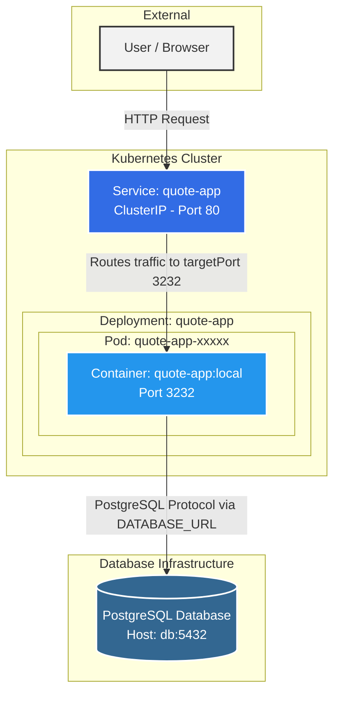

# Architecture du Projet

## Diagramme d'Architecture

Voici un diagramme symbolisant le flux et l'organisation de l'application :



---

## Réponses aux questions

### 1. Where does isolation happen? (Où l'isolation se produit-elle ?)
L'isolation a lieu principalement à deux niveaux :
* **Niveau Conteneur (Docker) :** Les processus de l'application Node.js sont isolés du reste du système hôte via les *namespaces* et les *groups* de Linux. L'application possède son propre système de fichiers (l'image), ses propres bibliothèques et son propre réseau. 
* **Niveau Pod (Kubernetes) :** Le Pod encapsule les conteneurs et fournit une isolation logique supplémentaire au sein du cluster Kubernetes en leur attribuant une IP unique et un espace réseau partagé exclusif.

### 2. What restarts automatically? (Qu'est-ce qui redémarre automatiquement ?)
Ce sont les **Pods (et leurs conteneurs sous-jacents)** qui redémarrent automatiquement. 
* Si le processus du conteneur Node.js (ou la sonde `readinessProbe`) subit une erreur fatale ou s'arrête (`crash`), le Kubelet du nœud va automatiquement redémarrer le conteneur.
* Si un Pod tout entier échoue, est supprimé, ou que le nœud physique "meurt", la ressource **Deployment** (grâce à son **ReplicaSet**) détecte que le nombre de réplicas en cours (0) ne correspond pas au nombre de réplicas désiré (`replicas: 1`). Elle va donc automatiquement déclencher la création d'un tout nouveau Pod pour le remplacer sans intervention humaine.

### 3. What does Kubernetes not manage? (Qu'est-ce que Kubernetes ne gère pas ?)
Bien que très puissant, Kubernetes ne gère pas :
* **La logique de l'application et ses bugs :** Si le code Node.js renvoie des erreurs 500 ou que la logique métier est défaillante (sans pour autant crasher le processus), Kubernetes ne corrigera pas l'application pour vous.
* **Les données dans la base PostgreSQL :** Si des enregistrements sont supprimés ou que les données de la base sont corrompues, Kubernetes n'est pas responsable du contenu de la base de données. Il peut s'assurer que le service qui héberge la base tourne, mais il ne gère pas les sauvegardes métiers ou les migrations SQL.
* **Le DNS / Routage externe sans configuration explicite :** Dans ce projet, vous n'avez configuré qu'un service `ClusterIP` (interne). Kubernetes ne gérera pas un accès public externe (comme un nom de domaine ou un CDN) tant qu'une ressource **Ingress** ou **LoadBalancer** n'est pas explicitement définie.

---

## Comparaison Conteneurs vs Machines Virtuelles (VM)

### Tableau comparatif

| Critère | Conteneurs | Machines virtuelles (VM) |
| :--- | :--- | :--- |
| **Partage du noyau (Kernel)** | Partagent le noyau du système d'exploitation de l'hôte (Linux). | Chaque VM a son propre système d'exploitation complet et son propre noyau, géré par un hyperviseur. |
| **Temps de démarrage** | Très rapide (quelques millisecondes à secondes) car il n'y a pas d'OS à démarrer. | Plus lent (plusieurs secondes à minutes) car un système d'exploitation entier doit *booter*. |
| **Surcoût de ressources (Overhead)** | Très faible. Ce sont de simples processus isolés sans duplication de l'OS. | Élevé. Chaque VM nécessite des ressources CPU, RAM et disque virtuelles dédiées pour faire tourner son propre OS. |
| **Isolation et sécurité** | Isolation logique via les fonctionnalités du noyau Linux (Namespaces, cgroups). Moins forte qu'une VM. | Isolation matérielle (virtualisée). Chaque VM est totalement cloisonnée des autres par l'hyperviseur. Très haute sécurité. |
| **Complexité opérationnelle** | Images légères, déploiement massif et orchestration complexe (ex: Kubernetes). Cycle de vie rapide. | Gestion plus lourde : il faut patcher, mettre à jour et maintenir l'OS de chaque VM individuellement. |

### Quand préférer une VM à un conteneur ?

Vous devriez privilégier une Machine Virtuelle dans les cas suivants :
* **Besoin d'une isolation stricte de sécurité :** Par exemple, si vous hébergez des applications pour différents clients "hostiles" sur la même machine physique (multi-tenant) ou si vous avez de fortes contraintes de conformité réglementaire.
* **Incompatibilité de système d'exploitation :** Si vous êtes sur un serveur hôte Linux mais que votre application ne peut tourner que sur Windows Server ou FreeBSD. Un conteneur Linux ne peut pas faire tourner nativement un environnement Windows.
* **Applications historiques (Legacy) :** Une vieille architecture monolithique qui requiert un environnement OS complet (avec des démons spécifiques, accès noyau modifiés, etc.) et qui n'est pas "conteneurisable".

### Quand combiner les deux ?

Dans l'industrie, VM et conteneurs ne sont pas des ennemis, ils sont presque toujours combinés !
* **Kubernetes hébergé sur des VMs (Le standard Cloud) :** C'est le cas le plus fréquent (AWS EKS, Google GKE). Les "nœuds" (nodes) de votre cluster Kubernetes sont en réalité des Machines Virtuelles. Les VMs apportent l'isolation matérielle et l'allocation des serveurs, tandis que Kubernetes (les conteneurs) apporte la flexibilité du déploiement logiciel par-dessus.
* **Séparation par criticité :** Mettre l'application web (front-end et back-end) dans des conteneurs légers et facilement réplicables dans un cluster, mais placer la **base de données de production critique** (ex: PostgreSQL) sur une Machine Virtuelle dédiée pour de meilleures performances disques garanties, des sauvegardes, persistance et une isolation totale.

---

## Comportement lors de la mise à l'échelle (Scaling)

Après avoir exécuté la commande `kubectl scale deployment quote-app --replicas=3`, voici ce qui se passe :

### 1. What changes when you scale? (Qu'est-ce qui change ?)

* **Le nombre de Pods "quote-app" :** Kubernetes (via le `ReplicaSet` du `Deployment`) va démarrer deux nouveaux Pods identiques au premier. Vous passez de 1 à 3 processus d'application Node.js s'exécutant en parallèle.
* **La répartition de la charge (Load Balancing interne) :** Si vous rafraîchissez la page de nombreuses fois (avec le port-forward actif sur le Service), ou si des centaines d'utilisateurs visitent le site, le `Service` Kubernetes va désormais agir comme un Load Balancer. Il va distribuer aléatoirement (techniquement en *round-robin* via iptables/IPVS) les requêtes HTTP entre les 3 Pods disponibles.
* **La haute disponibilité (Résilience) :** Si l'un des trois conteneurs Node.js crashe, les deux autres continuent de servir les requêtes sans interruption pendant que Kubernetes redémarre le Pod défaillant.

### 2. What does not change? (Qu'est-ce qui ne change pas ?)

* **Le comportement vu par l'utilisateur final :** Les réponses de l'application restent cohérentes (*les citations affichées sont les mêmes*). Le code exécuté sur les 3 Pods est strictement le même. 
* **Le point d'entrée réseau (Le Service) :** L'adresse IP du `Service` (`ClusterIP`) et son port restent exactement les mêmes. Les requêtes continuent d'entrer par le même tuyau. Seule la destination de sortie du tuyau change dynamiquement.
* **La Base de données (PostgreSQL) :** Nous n'avons mis à l'échelle que l'application Node.js (`quote-app`), pas la base de données. Les 3 Pods Node.js vont donc tous se connecter en même temps (connexions concurrentes) à **l'unique instance** de la base de données PostgreSQL pour y lire ou écrire les mêmes enregistrements. C'est pourquoi l'affichage des citations reste cohérent.

---

## Simulation de Panne (Suppression d'un Pod)

Après avoir exécuté la commande `kubectl delete pod <pod-name>`, un nouveau Pod est immédiatement visible via `kubectl get pods`.

### 1. Who recreated the pod? (Qui a recréé le Pod ?)
C'est le **Deployment** (et plus précisément le **ReplicaSet** qu'il gère en arrière-plan) qui a recréé le Pod.

### 2. Why? (Pourquoi ?)
Dans Kubernetes, un Deployment a pour rôle de s'assurer que l'état *réel* du cluster correspond toujours à l'état *désiré* (défini dans le fichier `deployment.yaml`). 
* L'état désiré est : `replicas: 3` (suite à notre mise à l'échelle).
* En supprimant un Pod, l'état réel tombe à `2` Pods.
* Le ReplicaSet détecte instantanément cette différence (boucle de contrôle / *control loop*) et demande immédiatement la création d'un nouveau Pod pour atteindre à nouveau le chiffre magique de `3`. C'est le principe d'**auto-guérison** (*Self-healing*).

### 3. What would happen if the node itself failed? (Que se passerait-il si le nœud physique/VM tombait en panne ?)
Si le serveur entier (le *Nœud*) sur lequel s'exécutent les Pods venait à crasher (panne matérielle, déconnexion réseau, etc.) :
1. Le gestionnaire de cluster (Control Plane) ne recevrait plus de signe de vie (*heartbeats*) du Kubelet de ce nœud.
2. Après un certain délai (généralement 5 minutes par défaut), Kubernetes marquerait le nœud comme "Non-Ready".
3. Le **ReplicaSet** constaterait que les 3 Pods qui tournaient sur ce nœud sont perdus.
4. Kubernetes **re-planifierait (reschedule) automatiquement** ces 3 Pods sur d'**autres nœuds sains** du cluster (si vous avez un cluster multi-nœuds). 
5. Le `Service` mettrait à jour ses *Endpoints* pour rediriger le trafic vers les nouvelles adresses IP des Pods sur les nouveaux nœuds. Le tout sans intervention humaine.

---

## Contraintes de Ressources (Requests et Limits)

### 1. What are requests vs limits? (Que sont les Requests et les Limits ?)
Dans Kubernetes, on contrôle l'allocation des ressources (CPU et Mémoire) d'un conteneur à l'aide de deux paramètres :
* **Requests (Demandes) :** C'est la quantité **minimale garantie** dont le conteneur a besoin. Ce paramètre est utilisé par le *Scheduler* de Kubernetes pour décider sur quel nœud placer le Pod. Le Pod ne sera déployé que sur un nœud disposant d'assez de ressources libres pour satisfaire cette demande (ici 100m CPU et 128Mi RAM).
* **Limits (Limites) :** C'est le **plafond maximal autorisé**. Si le conteneur essaie de consommer plus de mémoire que sa limite (ici 256Mi), Kubernetes le tue (erreur *Out Of Memory - OOMKilled*). S'il essaie de consommer plus de CPU que sa limite (250m), il est bridé (throttled), mais n'est pas tué.

### 2. Why are they important in multi-tenant systems? (Pourquoi sont-ils importants dans des systèmes multi-locataires ?)
Un système *multi-tenant* signifie que plusieurs équipes ou clients partagent le même cluster Kubernetes physique.
* **Éviter l'effet "Noisy Neighbor" (voisin bruyant) :** Sans *limits*, un seul Pod victime d'une fuite de mémoire ou d'une boucle infinie (bug) pourrait accaparer les 100% de la RAM ou du CPU du serveur physique. Cela ferait crasher tous les autres Pods des autres clients hébergés sur la même machine. Les limites garantissent qu'un Pod défaillant n'affecte que lui-même.
* **Garantie de service (QoS) :** Les *requests* permettent d'assurer contractuellement à chaque locataire (tenant) qu'il aura toujours au minimum la ressource pour laquelle il paie, quelles que soient les activités des autres utilisateurs du cluster.
* **Planification de la capacité (Capacity Planning) :** En additionnant toutes les *requests* du cluster, les administrateurs savent précisément à quel moment le cluster est plein et quand il faut acheter ou louer de nouveaux serveurs (Nœuds).

---

## Sondes de Santé (Health Checks)

Nous avons ajouté deux types de sondes dans le fichier `deployment.yaml` pour vérifier la santé de notre application :

```yaml
readinessProbe:
  httpGet:
    path: /
    port: 3232
  initialDelaySeconds: 5
  periodSeconds: 5
livenessProbe:
  httpGet:
    path: /
    port: 3232
  initialDelaySeconds: 5
  periodSeconds: 10
```

### 1. What is the difference between readiness and liveness? (Quelle est la différence entre Liveness et Readiness ?)
Bien qu'elles se configurent de la même manière (par exemple via une requête HTTP GET), leurs **conséquences en cas d'échec** sont totalement différentes :

* **Liveness Probe (Sonde de vie) :** Elle répond à la question *"Le processus est-il planté ou bloqué ?"*. 
  * **Cas d'usage :** Imaginons qu'une erreur de code provoque une boucle infinie ou un *deadlock* dans Node.js : le processus tourne toujours, la RAM est occupée, mais il ne peut plus répondre. 
  * **Conséquence en cas d'échec :** Kubernetes **tue et redémarre** brutalement le conteneur (*Restart*). 
  
* **Readiness Probe (Sonde de disponibilité) :** Elle répond à la question *"L'application est-elle prête à recevoir activement du trafic réseau ?"*.
  * **Cas d'usage :** Au démarrage (quand Node.js doit d'abord se connecter à PostgreSQL avant de répondre) ou lors d'un pic de charge soudain saturant le serveur limitant son espace de réponse.
  * **Conséquence en cas d'échec :** Kubernetes ne redémarre pas le Pod. Il le **retire momentanément des points de terminaison (*Endpoints*) du Service**. Le Pod ne reçoit plus de requêtes utilisateur jusqu'à ce que la sonde de *Readiness* repasse au vert. Le temps qu'il respire.

### 2. Why does this matter in production? (Pourquoi est-ce crucial en production ?)

Ne pas configurer ces deux sondes en production a des conséquences dramatiques :

* **Mises à jour sans interruption (*Zero-downtime*) :** Sans **readinessProbe**, lors d'un nouveau déploiement, Kubernetes enverra immédiatement du trafic réseau au nouveau Pod... avant même que son application Node.js n'ait eu le temps de s'ouvrir ! Les utilisateurs recevront des erreurs `502 Bad Gateway` pendant les premières secondes. La *Readiness* garantit des déploiements 100% fluides.
* **Résilience autonome :** Sans **livenessProbe**, si votre application bloque (ex: OutOfMemoryError interceptée mais bloquante), le conteneur reste dans un état "Running" fantôme. Il continuera de recevoir du trafic utilisateur qui tombera dans le vide (*Timeouts*). Avec une *Liveness*, le cluster s'auto-répare instantanément à 3h du matin sans qu'un ingénieur d'astreinte n'ait besoin de se réveiller.
