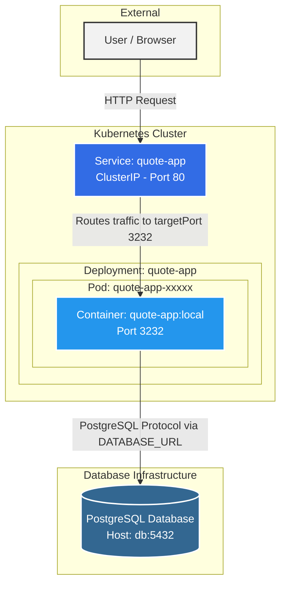

# Architecture du Projet

## Diagramme d'Architecture

Voici un diagramme symbolisant le flux et l'organisation de l'application :

---

## Réponses aux questions

### 1. Where does isolation happen? (Où l'isolation se produit-elle ?)
L'isolation a lieu principalement à deux niveaux :
* **Niveau Conteneur (Docker) :** Les processus de l'application Node.js sont isolés du reste du système hôte via les *namespaces* et les *cgroups* de Linux. L'application possède son propre système de fichiers (l'image), ses propres bibliothèques et son propre réseau. 
* **Niveau Pod (Kubernetes) :** Le Pod encapsule le(s) conteneur(s) et fournit une isolation logique supplémentaire au sein du cluster Kubernetes en leur attribuant une IP unique et un espace réseau partagé exclusif.

### 2. What restarts automatically? (Qu'est-ce qui redémarre automatiquement ?)
Ce sont les **Pods (et leurs conteneurs sous-jacents)** qui redémarrent automatiquement. 
* Si le processus du conteneur Node.js (ou la sonde `readinessProbe`) subit une erreur fatale ou s'arrête (`crash`), le Kubelet du nœud va automatiquement redémarrer le conteneur.
* Si un Pod tout entier échoue, est supprimé, ou que le nœud physique "meurt", la ressource **Deployment** (grâce à son **ReplicaSet**) détecte que le nombre de réplicas en cours (0) ne correspond pas au nombre de réplicas désiré (`replicas: 1`). Elle va donc automatiquement déclencher la création d'un tout nouveau Pod pour le remplacer sans intervention humaine.

### 3. What does Kubernetes not manage? (Qu'est-ce que Kubernetes ne gère pas ?)
Bien que très puissant, Kubernetes ne gère pas :
* **La logique de l'application et ses bugs :** Si le code Node.js renvoie des erreurs 500 ou que la logique métier est défaillante (sans pour autant crasher le processus), Kubernetes ne corrigera pas l'application pour vous.
* **Les données dans la base PostgreSQL :** Si des enregistrements sont supprimés ou que les données de la base sont corrompues, Kubernetes n'est pas responsable du contenu de la base de données. Il peut s'assurer que le service qui héberge la base tourne, mais il ne gère pas les sauvegardes métiers ou les migrations SQL.
* **Le DNS / Routage externe sans configuration explicite :** Dans ce projet, vous n'avez configuré qu'un service `ClusterIP` (interne). Kubernetes ne gérera pas un accès public externe (comme un nom de domaine ou un CDN) tant qu'une ressource **Ingress** ou **LoadBalancer** n'est pas explicitement définie.
