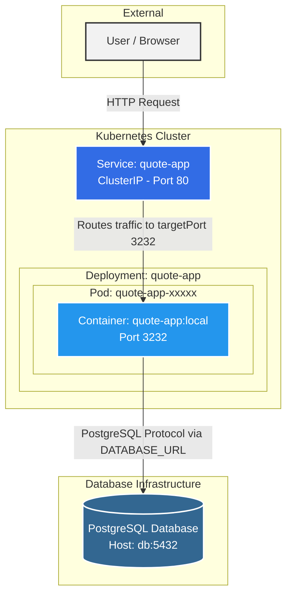

# Architecture du Projet

## Diagramme d'Architecture

Voici un diagramme symbolisant le flux et l'organisation de l'application :

---

## Réponses aux questions

### 1. Where does isolation happen? (Où l'isolation se produit-elle ?)
L'isolation a lieu principalement à deux niveaux :
* **Niveau Conteneur (Docker) :** Les processus de l'application Node.js sont isolés du reste du système hôte via les *namespaces* et les *groups* de Linux. L'application possède son propre système de fichiers (l'image), ses propres bibliothèques et son propre réseau. 
* **Niveau Pod (Kubernetes) :** Le Pod encapsule les conteneurs et fournit une isolation logique supplémentaire au sein du cluster Kubernetes en leur attribuant une IP unique et un espace réseau partagé exclusif.

### 2. What restarts automatically? (Qu'est-ce qui redémarre automatiquement ?)
Ce sont les **Pods (et leurs conteneurs sous-jacents)** qui redémarrent automatiquement. 
* Si le processus du conteneur Node.js (ou la sonde `readinessProbe`) subit une erreur fatale ou s'arrête (`crash`), le Kubelet du nœud va automatiquement redémarrer le conteneur.
* Si un Pod tout entier échoue, est supprimé, ou que le nœud physique "meurt", la ressource **Deployment** (grâce à son **ReplicaSet**) détecte que le nombre de réplicas en cours (0) ne correspond pas au nombre de réplicas désiré (`replicas: 1`). Elle va donc automatiquement déclencher la création d'un tout nouveau Pod pour le remplacer sans intervention humaine.

### 3. What does Kubernetes not manage? (Qu'est-ce que Kubernetes ne gère pas ?)
Bien que très puissant, Kubernetes ne gère pas :
* **La logique de l'application et ses bugs :** Si le code Node.js renvoie des erreurs 500 ou que la logique métier est défaillante (sans pour autant crasher le processus), Kubernetes ne corrigera pas l'application pour vous.
* **Les données dans la base PostgreSQL :** Si des enregistrements sont supprimés ou que les données de la base sont corrompues, Kubernetes n'est pas responsable du contenu de la base de données. Il peut s'assurer que le service qui héberge la base tourne, mais il ne gère pas les sauvegardes métiers ou les migrations SQL.
* **Le DNS / Routage externe sans configuration explicite :** Dans ce projet, vous n'avez configuré qu'un service `ClusterIP` (interne). Kubernetes ne gérera pas un accès public externe (comme un nom de domaine ou un CDN) tant qu'une ressource **Ingress** ou **LoadBalancer** n'est pas explicitement définie.

---

## Comparaison Conteneurs vs Machines Virtuelles (VM)

### Tableau comparatif

| Critère | Conteneurs | Machines virtuelles (VM) |
| :--- | :--- | :--- |
| **Partage du noyau (Kernel)** | Partagent le noyau du système d'exploitation de l'hôte (Linux). | Chaque VM a son propre système d'exploitation complet et son propre noyau, géré par un hyperviseur. |
| **Temps de démarrage** | Très rapide (quelques millisecondes à secondes) car il n'y a pas d'OS à démarrer. | Plus lent (plusieurs secondes à minutes) car un système d'exploitation entier doit *booter*. |
| **Surcoût de ressources (Overhead)** | Très faible. Ce sont de simples processus isolés sans duplication de l'OS. | Élevé. Chaque VM nécessite des ressources CPU, RAM et disque virtuelles dédiées pour faire tourner son propre OS. |
| **Isolation et sécurité** | Isolation logique via les fonctionnalités du noyau Linux (Namespaces, cgroups). Moins forte qu'une VM. | Isolation matérielle (virtualisée). Chaque VM est totalement cloisonnée des autres par l'hyperviseur. Très haute sécurité. |
| **Complexité opérationnelle** | Images légères, déploiement massif et orchestration complexe (ex: Kubernetes). Cycle de vie rapide. | Gestion plus lourde : il faut patcher, mettre à jour et maintenir l'OS de chaque VM individuellement. |

### Quand préférer une VM à un conteneur ?

Vous devriez privilégier une Machine Virtuelle dans les cas suivants :
* **Besoin d'une isolation stricte de sécurité :** Par exemple, si vous hébergez des applications pour différents clients "hostiles" sur la même machine physique (multi-tenant) ou si vous avez de fortes contraintes de conformité réglementaire.
* **Incompatibilité de système d'exploitation :** Si vous êtes sur un serveur hôte Linux mais que votre application ne peut tourner que sur Windows Server ou FreeBSD. Un conteneur Linux ne peut pas faire tourner nativement un environnement Windows.
* **Applications historiques (Legacy) :** Une vieille architecture monolithique qui requiert un environnement OS complet (avec des démons spécifiques, accès noyau modifiés, etc.) et qui n'est pas "conteneurisable".

### Quand combiner les deux ?

Dans l'industrie, VM et conteneurs ne sont pas des ennemis, ils sont presque toujours combinés !
* **Kubernetes hébergé sur des VMs (Le standard Cloud) :** C'est le cas le plus fréquent (AWS EKS, Google GKE). Les "nœuds" (nodes) de votre cluster Kubernetes sont en réalité des Machines Virtuelles. Les VMs apportent l'isolation matérielle et l'allocation des serveurs, tandis que Kubernetes (les conteneurs) apporte la flexibilité du déploiement logiciel par-dessus.
* **Séparation par criticité :** Mettre l'application web (front-end et back-end) dans des conteneurs légers et facilement réplicables dans un cluster, mais placer la **base de données de production critique** (ex: PostgreSQL) sur une Machine Virtuelle dédiée pour de meilleures performances disques garanties, des sauvegardes, persistance et une isolation totale.
