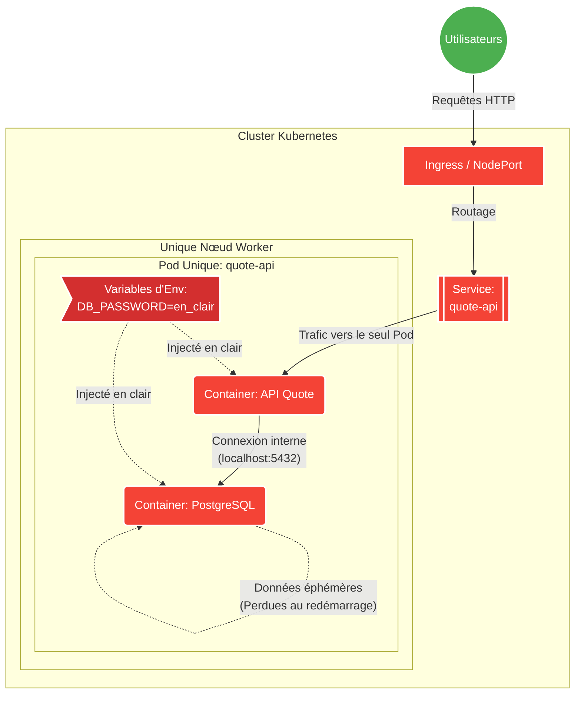
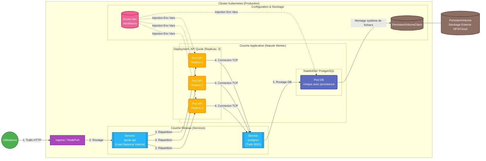

# Current System Problems

Voici à quoi ressemble l'architecture problématique actuelle :

## 1. Base de données et application dans le même conteneur (Anti-pattern)
* **Quel est le problème ?**
L'API Quote et la base de données PostgreSQL s'exécutent au sein du même conteneur ou du même Pod.
* **Pourquoi est-ce important ?**
Dans Kubernetes, les conteneurs sont éphémères. Un Pod doit idéalement représenter un seul composant ou des composants fortement couplés dont l'un sert l'autre (principe de séparation des préoccupations). Mélanger une application sans état (stateless) avec une base de données avec état (stateful) empêche de faire évoluer, de mettre à jour ou de gérer l'état des deux de manière indépendante.
* **Quels risques de défaillance ou opérationnels cela pourrait-il engendrer ?**
Si l'application plante et que le Pod redémarre, la base de données redémarre également, entraînant une coupure de service totale. De plus, aucune persistance des données (PersistentVolumes) n'étant mentionnée, toutes les données (citations, paramètres) seront perdues à chaque redémarrage du conteneur. Enfin, impossible de faire évoluer (scaler) l'API seule (ajouter des réplicas) sans instancier de nouvelles bases de données indépendantes et désynchronisées.

## 2. Secrets stockés en clair dans des variables d'environnement
* **Quel est le problème ?**
Les données sensibles, comme les mots de passe de la base de données, sont définies en clair dans les variables d'environnement du déploiement.
* **Pourquoi est-ce important ?**
La sécurité est primordiale en production. Stocker des secrets en clair signifie que toute personne ayant un accès en lecture à la définition du déploiement, au système de contrôle de version (Git) ou à l'API Kubernetes peut lire ces informations sensibles.
* **Quels risques de défaillance ou opérationnels cela pourrait-il engendrer ?**
Le risque majeur est la fuite de données et la compromission du système. Un attaquant ou un employé malveillant pourrait récupérer ces secrets et s'introduire dans le système de base de données, exfiltrant, modifiant ou supprimant potentiellement toutes les données professionnelles. Les secrets doivent utiliser la ressource `Secret` de Kubernetes, ou mieux, un gestionnaire de secrets externe (ex: HashiCorp Vault ou AWS Secrets Manager).

## 3. Absence de sondes (Liveness/Readiness) et de limites de ressources (Requests/Limits)
* **Quel est le problème ?**
Le système ne configure ni sondes de vivacité ou de disponibilité, ni limites de ressources (CPU/RAM).
* **Pourquoi est-ce important ?**
Kubernetes utilise les sondes (probes) pour savoir si un Pod est prêt à recevoir du trafic (Readiness) ou s'il est bloqué et doit être redémarré (Liveness). Les limites de ressources garantissent qu'un Pod ne consomme pas indéfiniment les ressources du nœud hébergeur, ce qui pourrait impacter d'autres applications.
* **Quels risques de défaillance ou opérationnels cela pourrait-il engendrer ?**
Sans Readiness Probe, Kubernetes peut envoyer des utilisateurs vers un Pod qui est en train de démarrer (ce qui provoque des erreurs 502/503). Sans Liveness Probe, si l'application entre dans une boucle infinie ou un "deadlock", Kubernetes ne s'en rendra pas compte et ne la redémarrera pas, laissant le service indisponible. Sans limites de ressources, une fuite de mémoire dans le code peut consommer toute la RAM du nœud ("Noisy Neighbor"), entraînant le crash système (OOMKill) du nœud entier et de tout ce qui y tourne.

## 4. Dépendance à un seul Pod et remplacements immédiats (Downtime garanti)
* **Quel est le problème ?**
L'application ne s'exécute que sur un seul Pod (Single Point of Failure) et les déploiements remplacent immédiatement les pods au lieu d'effecter des mises à jour progressives (Rolling Update).
* **Pourquoi est-ce important ?**
La haute disponibilité et le "Zero Downtime Deployment" sont des standards en production. Avoir une seule instance signifie qu'il n'y a aucune tolérance aux pannes.
* **Quels risques de défaillance ou opérationnels cela pourrait-il engendrer ?**
À chaque mise à jour (évolution du code ou correction de bug), le Pod actuel est arrêté avant que le nouveau ne soit prêt, entraînant une interruption totale du service pour les utilisateurs. De même, si le nœud sous-jacent tombe en panne, l'application est complètement indisponible jusqu'à ce que le plan de contrôle (Control Plane) replanifie le Pod sur un nouveau nœud et qu'il démarre. Ce comportement est inacceptable en production.

# Production Architecture

Pour corriger les problèmes identifiés, voici une conception prête pour la production.

## Composants de l'architecture

1. **Déploiement de l'Application (API Quote)**
   - L'application est gérée par une ressource `Deployment`.
   - **Réplicas multiples :** Configuration avec `replicas: 3` pour assurer la haute disponibilité et la répartition de la charge.
   - **Sondes :** Ajout de `livenessProbe` et `readinessProbe` pour garantir que le trafic n'atteint que les Pods sains.
   - **Stratégie de déploiement sûre :** Stratégie `RollingUpdate` avec `maxUnavailable` et `maxSurge` configurés pour garantir des mises à jour sans temps d'arrêt (**Zero-Downtime**).

2. **Un service exposant l'application**
   - Un `Service` de type `ClusterIP` associé à un `Ingress` (ou un `NodePort` si pas d'Ingress Controller) permet d'exposer l'API et de répartir le trafic réseau entre les différents réplicas de l'API.

3. **Une base de données PostgreSQL avec stockage persistant**
   - **Pod dédié :** PostgreSQL a son propre `StatefulSet` ou `Deployment`, totalement séparé de l'application.
   - **Stockage Persistant :** Utilisation d'un `PersistentVolumeClaim` (PVC) pour stocker les données sur un `PersistentVolume` (PV) externe. Les données ne sont plus perdues si le Pod de la base de données redémarre ou est déplacé.

4. **Gestion sécurisée des Secrets**
   - Les mots de passe sont stockés en sécurité via une ressource `Secret` Kubernetes et injectés en tant que variables d'environnement dans les Pods lors de leur création.

## Schéma d'Architecture

Voici le diagramme représentant cette architecture :

# Operational Strategy

## Comment le système évolue-t-il ?
L'évolution du système (ou scalabilité) est gérée à deux niveaux :
1. **Mise à l'échelle de l'application (Pods) :** Grâce au `Deployment`, Kubernetes peut augmenter ou diminuer le nombre de réplicas de l'API Quote manuellement (`kubectl scale`) ou automatiquement via un **HPA (Horizontal Pod Autoscaler)**. Le HPA surveille l'utilisation des ressources (ex: CPU, mémoire) définie dans les `limits` et `requests`, et adapte le nombre de Pods en fonction de la charge (pics de trafic). Le `Service` répartit alors automatiquement le trafic entrant vers tous les nouveaux Pods.
2. **Mise à l'échelle de l'infrastructure (Nœuds) :** Si le cluster manque de ressources matérielles pour accueillir de nouveaux Pods, un **Cluster Autoscaler** (au niveau du fournisseur Cloud) peut ajouter dynamiquement de nouveaux nœuds Worker au cluster.

## Comment les mises à jour sont-elles déployées en toute sécurité ?
Les mises à jour utilisent une stratégie de **Rolling Update** (mise à jour progressive).
* Le `Deployment` crée un nouveau `ReplicaSet` pour la nouvelle version de l'application.
* Il démarre progressivement les nouveaux Pods et attend qu'ils soient signalés comme "Prêts" (grâce à la `readinessProbe`) avant de faire transiter du trafic vers eux.
* Simultanément, il termine progressivement les anciens Pods.
* Les paramètres `maxSurge` (nombre maximum de Pods supplémentaires autorisés pendant la mise à jour) et `maxUnavailable` (nombre maximum de Pods indisponibles simultanément) garantissent qu'à tout moment, un nombre suffisant d'anciennes ou de nouvelles instances répondent aux utilisateurs. Le résultat est un déploiement sans aucune interruption de service (**Zero-Downtime**).

## Comment les pannes sont-elles détectées ?
Les pannes sont détectées de manière proactive et réactive via les **Sondes (Probes)** configurées sur les conteneurs :
1. **Liveness Probe (Sonde de vivacité) :** Kubernetes vérifie périodiquement si l'application est "vivante" et réactive. Si l'application entre dans une boucle infinie ou crashe silencieusement (renvoie une erreur HTTP 500 continue ou un timeout sur un port TCP), la sonde échoue. Kubernetes "tue" alors le conteneur bloqué et le redémarre immédiatement.
2. **Readiness Probe (Sonde de disponibilité) :** Kubernetes l'utilise pour savoir si le Pod est prêt à traiter les requêtes entrantes. Si un Pod est surchargé, qu'il perd sa connexion à la DB ou qu'il met du temps à initialiser son cache au démarrage, cette sonde échoue. Le Pod n'est pas redémarré, mais le trafic du trafic `Service` lui est instantanément coupé jusqu'à ce que la sonde réussisse à nouveau.

## Quels contrôleurs Kubernetes gèrent la récupération ?
En cas de panne matérielle d'un nœud ou de la suppression accidentelle d'un composant, plusieurs **Contrôleurs Kubernetes** (faisant partie du Control Plane) interviennent en boucle de contrôle continue pour ramener l'état actuel vers l'état désiré (déclaré dans les fichiers YAML) :
1. **ReplicaSet Controller (via le Deployment) :** Surveille l'API Quote. Si un ou plusieurs Pods sont supprimés ou que le nœud sur lequel ils tournaient s'effondre, le contrôleur recrée instantanément le nombre exact de Pods manquants (définis par `.spec.replicas`) sur les autres nœuds sains du cluster.
2. **StatefulSet Controller :** S'assure que le Pod PostgreSQL est recréé et garanti qu'il rattache le même `PersistentVolume` au nouveau nœud pour ne perdre aucune donnée.
3. **Endpoint Controller :** Met à jour dynamiquement la liste des adresses IP des Pods actifs et "Prêts" rattachés aux différents `Services`, assurant ainsi que le routage du trafic ignore toujours les Pods défaillants.

# Weakest Point

## Quel est le point faible de votre architecture et pourquoi ?
Malgré les nombreuses améliorations apportées pour garantir la haute disponibilité de l'application (l'API Quote), **le point faible majeur de cette architecture reste la base de données PostgreSQL.**

Actuellement, bien que les données soient sauvegardées de manière persistante (grâce au `PersistentVolumeClaim`), il n'y a **qu'une seule instance (Pod) de PostgreSQL** qui fonctionne à la fois.
1. **Goulet d'étranglement des performances (Bottleneck) :** Si le trafic utilisateur explose, l'API Quote pourra automatiquement évoluer (Scale Out) grâce au HPA et ajouter de nombreux réplicas. Cependant, toutes ces instances de l'API viendront "taper" sur la même et unique base de données. Arrivée à une certaine limite opérationnelle (CPU, RAM, connexions simultanées, ou I/O disque), la base de données ne pourra plus répondre aux requêtes, rendant l'API très lente puis inutilisable.
2. **Temps d'Indisponibilité (Downtime) lors d'une panne du Nœud :** Si le nœud physique hébergeant le Pod PostgreSQL tombe en panne, le contrôleur `StatefulSet` recréera bien le Pod sur un autre nœud. Cependant, le temps que le crash soit détecté, qu'un nouveau nœud s'alloue le volume persistant, que l'image du conteneur démarre et que le moteur de base de données s'initialise, l'application sera **totalement incapable de servir ou d'enregistrer des données pendant plusieurs minutes**.

## Comment y remédier à terme ?
Pour véritablement rendre ce système résilient à de très fortes contraintes et à des pannes sectorielles, il faudrait mettre en place un **Cluster de bases de données (ex: PostgreSQL Haute Disponibilité)** avec :
* **Une topologie Primary-Replica (Leader/Follower) :** Un nœud Master gère les écritures, et plusieurs nœuds Replicas gèrent les lectures (ce qui répartit la charge).
* **Failover automatique :** En cas de perte du nœud Master, l'un des nœuds Replica prend instantanément sa place sans intervention humaine et de façon presque transparente pour l'API. (Des solutions comme *CrunchyData PGO*, *Zalando Postgres Operator*, ou un service managé cloud comme *AWS RDS Multi-AZ* permettent de gérer cette complexité).

---

## Réflexion optionnelle (Architecture avancée)

### 1. Qu'est-ce qui céderait en premier en cas de trafic multiplié par 10 ?
La base de données PostgreSQL. L'application (Deployment K8s) avec un HPA va rajouter des Pods (scale out) pour absorber les requêtes HTTP, mais tous ces Pods vont ouvrir de nouvelles connexions simultanées vers l'unique Pod de la base de données. PostgreSQL va s'effondrer sous le nombre de connexions (erreur *too many clients already*), épuiser son CPU ou saturer les entrées/sorties de son disque (IOPS), paralysant ainsi toute l'application.

### 2. Quels signaux de surveillance surveilleriez-vous en premier ?
- **Au niveau applicatif (Node.js) :** Le taux d'erreurs (Erreurs HTTP 5xx/4xx) et la latence moyenne (temps de réponse) des requêtes HTTP.
- **Au niveau de la base de données :** Le nombre de connexions actives, l'utilisation CPU/RAM du conteneur DB, et les performances IOPS du disque persistant.
- **Au niveau de l'infrastructure K8s :** L'utilisation du CPU et de la mémoire globale des nœuds, pour s'assurer que de nouveaux Pods réplicas ne vont pas échouer avec l'état `Pending` faute de ressources, et les métriques des HPA.

### 3. Comment déploieriez-vous ce système sur plusieurs nœuds ou régions ?
- **Sur plusieurs nœuds (Résilience locale) :** Configurer le Deployment de l'API avec des règles de `podAntiAffinity` pour forcer K8s à toujours planifier les différents réplicas de l'application sur des nœuds physiques distincts.
- **Sur plusieurs régions (Haute dispo globale) :** Utiliser un cluster de base de données multi-régions (comme CockroachDB ou AWS Aurora Global Database qui gèrent la réplication de données entre continents), et mettre en place un équilibreur de charge au niveau réseau global (ex: AWS Route53 ou Cloudflare) qui route d'abord la requête vers le cluster Kubernetes de la région géographiquement la plus proche de l'utilisateur.

### 4. Quelle partie de ce système pourrait nécessiter des machines virtuelles plutôt que des conteneurs ?
**La base de données PostgreSQL de production.** Bien que K8s sache très bien gérer des BDD (via les StatefulSets / opérateurs), extraire la base de données hors du cluster pour la faire tourner sur des Machines Virtuelles dédiées (Bare-metal ou instances cloud optimisées mémoire/disque) est une pratique de production mature. Cela permet d'isoler drastiquement ses performances matérielles (élimination du risque de voisins bruyants ou "Noisy Neighbors" accaparant le disque sur les nœuds K8s), de stabiliser la latence I/O, et de simplifier fortement l'administration des snapshots, des back-ups système et du failover OS.